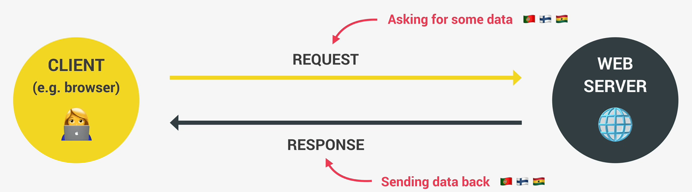

<h1>Asynchronous JavaScript, AJAX and APIs</h1>

**_Synchronous_**

To understand what Asynchronous JavaScript is, we must first understand what Synchronous JavaScript is first.
Synchronous is the opposite of Asynchronous.

Synchronous simply means that the code is executed line by line. In the exact order of execution that we defined in our code. Just like in this example:

```js
const p = document.querySelector('.p');
p.textContent = 'My name is Jonas! ';
alert('Text set!');
p.style.color = 'red';
```

Each line of code **waits** for previous line to finish execution. This can create problems when one line of code takes a very long time to run. In the example above, we have an alert statement which creates an alert window. This alert window will block the code execution. So nothing will happen on the page until we click the **OK** button / close the alert, and only then the code can continue executing. The alert statement here is a good example of a long running operation which blocks execution of the code. Most of the time, synchronous code if fine but imagine that execution would have to wait, for example: for a five seconds timer to finish, that's just terrible because meanwhile, nothing on the page would work during this five seconds. So that's where asynchronous is helpful.

***

**_Asynchronous_**

In this example, the first line of code is still synchronous, then we move to the second line in a synchronous way. But then we encounter the setTimeout function which will basically start a timer in a asynchronous way. So this means that the timer will essentially run in the background without preventing the main code from executing, we also defined a callback function which will not be executed now but only after the timer has finished running. This callback function is asynchronous JavaScript, it is asynchronous because it't only going to be executed after a task that is running in the background finishes execution, in this case, that is the timer. So this callback is defined and then we immediately move on to the next line. So the main code is not being blocked and execution does not wait for the asynchronous timer to finish its work.
```js
const p = document.querySelector('.p');
setTimeout(function () {
p.textContent = 'My name is Jonas!';
}, 5000);
p.style.color = 'red';
```

In summary, asynchronous programming is all about coordinating the behavior of our program over a certain period of time. It literally means not occuring at the same time.

Note: Callback functions alone does **NOT** make a code asynchronous. Also, event listeners alone does not make a code asynchronous.

***

**_AJAX_**

**A**synchronous **J**avascript **A**nd **X**ML: Allows us to communicate with remote web servers in an asynchronous way. With AJAX calls, we can
request data from web servers dynamically.



The operation above all happens asynchronously in the background. When we're asking a server to send us some data, this server usually contains a web API, this API is the one that has the data that we're asking for. 

***

**_API_**

**A**pplication **P**rogramming **I**nterface: Piece of software that can be used by another piece of software, in order to allow **applications to talk to each other**. It's like a menu in a restaurant. It's a list of options that a program gives you to interact with it. You can order specific things from the menu, just like how you can request data or actions from a program using its API. It's a way for different software to talk to each other and share information. There are many types of APIs in web development: DOM API, Geolocation API, Own Class API, "Online" API/API/Web API. 

**Online API**: Application running on a server, that receives requests for data, and sends data back as response.

**_API DATA FORMATS_**
1) **XML** data format: used to be widely used to transmit data on the web. However, these days, no API uses XML data anymore. The term AJAX is just an old name that got very popular back in the day, and so it's still used 'til today even though we don't use XML anymore.
2) **JSON** data format: the most popular data format today because it's basically just a JavaScript object but converted to a string. Therefore, it's very easy to send accross the web and also to use in JavaScript once the data arrives/received.
