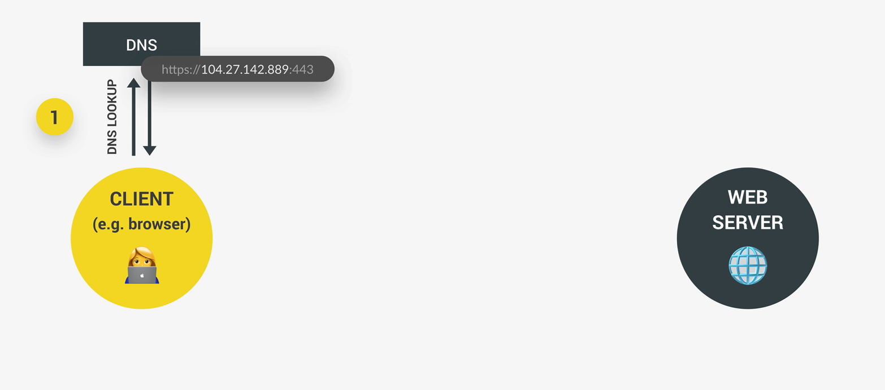
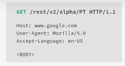
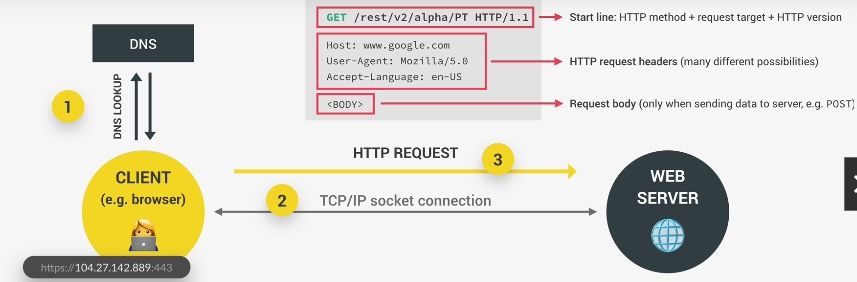
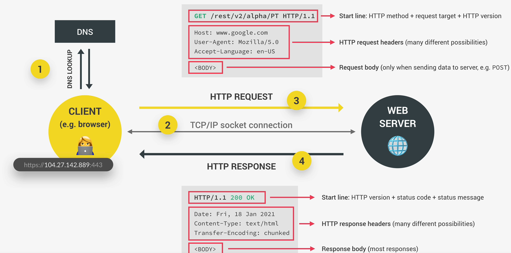
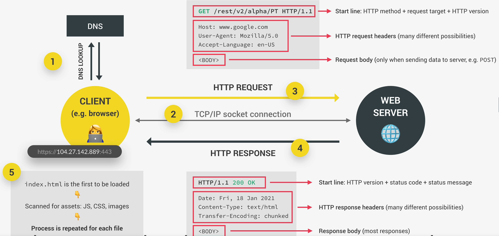
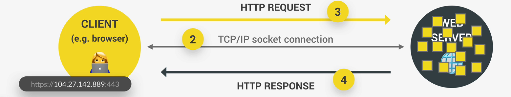
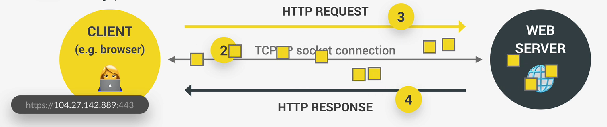

<h1>How the Web Works: Requests and Responses</h1>

This is a high level overview of how the Web actually works behind the scenes in regards to **requests** and **responses**.

***

When we try to access a web server, the browser, which is the client, sends a request to the server, then the server will send back a respons, and that response cotains the data or the web page that we/the client requested. This process works the exact same way no matter if we're accessing an entire web page or just some data from a web API. This process is called **"Request-response model" / "Client-server architecture"**

***

Let's take fetching data from an API as an example:

- Every URL gets an HTTP or HTTPS which is for the protocol that will be used on this connection.
- We have the domain name (restcountries.eu).
- Then we have the so-called **resource** that we want to access (/rest/v2) amd so on.

The domain name which is restcountries.eu is actually not the real address of the server that we're trying to access it's really just a nice name that is easy for us to remember.

But what this means is that we need a way of king of converting the domain name to the real address of the server. That happens through a so-called **D-N-S** (Domain Name Server), domain name servers are special kind of server. They are basically like the phone books of the internet. 

The first step that happens when we access any web server is that the browser makes a request to a DNS and this special server will then simply match the web address of the URL to the server's real IP address. This all happens through your internet service provider. You must always keep in mind the the domain is not the real address and that a DNS wil convert the domain to the real IP address. 

After the real IP address has been sent back to the browser, we can finally call it. You can look at the second image below to see how the real address look like. It still has the protocol, but then comes the IP address, and also the port that we access on the server. The port number is really just to identify a specific service that's running on a server. You can think of it like a sub-address. The port number has nothing to do with the /rest/v2 resource that we want to access. The resource will actually be sent over in the HTTP request.

Here's an illustration of this:

**DNS Lookup**

**IP address sent back to client**

***

Once we have the real IP address, a **TCP/IP socket connnection** is esthablished between the browser and the server, so they are now finally connected, this connection is typically kept alive for the entire time that it takes to transfer all files of the website or all data. 

What are TCP and IP?
- TCP is the Transmission Control Protocol.
- IP is the Internet Protocol.

Together, they are communication protocols that defined exacatly how data travels across the web they are basically the internet's fundamental control system because they are the ones who set the rules aboout how data moves on the internet.

Anyway, it's time to make our request. The request that we make is an HTTP request, where HTTP stands for **Hyper Transfer Protocol**. So after TCP/IP, HTTPS is another communication protocol, by the way, a communication protocol is simply a system of rules that allows two or more parties to communicate. In the case of HTTP, it's just a protocol that allows clients and web servers to communicate, and that works by sending requests and response messages from client to server and back. A request message will look something like the image below:

The beginning of the message is the most important part called the start line. This containes the HTTP method that is used in the request then the request target and the HTTP version. For HTTP request, there are many available but the most important ones are: **GET** for simply requesting data, **POST** for sending data, and **PUT** and **PATCH**, to basically modify data. As you can see, that an HTTP request to a server is not only for getting data but we can also send data. 

About the request target, this is where the server is told that we want to access the rest/v2/alpha resource in this case. Then the server can figure out what to do with it. If the target was empty, then we would be accessing the website's route, which is just restcountries.eu in this example.

The next part of the request are the request headers, which is just some information that we sent about the request itself. There are tons of standard different headers, like what browsers is used to make the requests, at what time, the user's language and many, many more. 

Finally, in the case we're sending data to the server, there will also be a request body. and that body will contain the data that we're sending. For example, coming from an HTML form. That is the HTTP request. Of course, it's not the developers who will manually write these HTTP requests, but it's valuable to understand that an HTTP request and a response look like. 

In addition, there's also HTTPS. The main difference between HTTP and HTTPS is that HTTPS is encrypted using TLS or SSL (which are some more protocols). The logic behind HTTP requests and responses still applies to HTTPS.

***

So our request if formed and now it hits the server, which will then be working on it until it has our data or web page ready to send back, once it's ready, it will send it back using am HTTP response. The HTTP response message actually looks similar to the request: with a start line, headers and a body.

The start line has besides the version also a status code and a message. These are used to let the client know wheter the request has been successful or failed. For example, 200 means OKAY. The status code that everyone knows is 404, which means page not found.  

The response headers are information about the response itself.

The response body, which is present in most reponses. This body usually containes the JSON data coming back from an API or the HTML ofthe web page what we requested. 

**This is all what's happening if all we do is to access an API**. 

If it's a webpage that we're accessing, there will be may more requests and reponses. Because when we do the first request, all we get back is just the initial HTML file. That HTML file will then get scanned by the browser for all the assets that it needs in order to build the entire web page like JavaScript, CSS files, image files, or other assets. And then for each different file, there will be a new HTTP request made to the server. So basically this entire back and forth between client and server happens for every single file that is included in the web page. However, there can be mutltiple requests and reponses happening at the same time but the amount is still limited because otherwise the connection would start to slow down. But when all the files have finally arrived then the wegpage can be rendered in the browser according to the HTML, CSS, and JavaScript specifications that you already know.

***

To complete, let's talk about TCP/IP and figure out how this request and response data is actually sent across the web.

TCP and IP are the communication protocols that define how data travels across the web. 

First, the job og TCP is tp break the requests and reponses down into thousands of small chunks called packets before they are sent. Once the small packets arrive at their final destination, TCP will reassemble all the packets into the original request or response. This is necessary so that each packet can take a different route through the internet, this way, the message arrives at the destination as quick as possible, which would not be possible if we sent the entire data simply as a big chunk. That would be like trying to go through dense traffic with like the biggest bus in the world.

Second, the job of the IP is to actually send and route these packets through the internet. It ensures that they arrive at the detination they should go using IP addresses on each packet.

**Request**: When you send a request to an API, TCP may break the request into smaller packets to be transmitted over the network, and IP ensures these packets reach the API server.

**Response**: When the API server processes your request and sends back a response, TCP and IP continue to be involved, but the process is a bit different:
- TCP: TCP on your computer still ensures the response packets are received reliably and in the correct order. It manages the connection between your computer and the API server. If any packets are lost during -the transmission, TCP will request retransmissions, just like it did with your request.
- IP: IP, in this case, plays the role of ensuring the response packets are routed back to your computer. It uses the IP address of your computer to send the response to the right destination.

 

  

