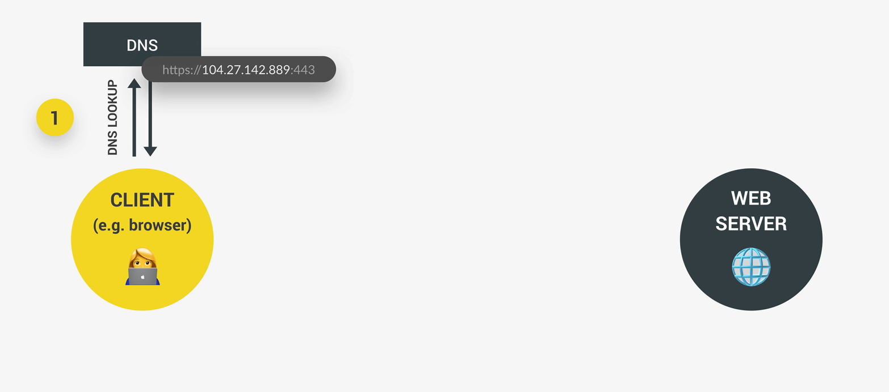

<h1>How the Web Works: Requests and Responses</h1>

This is a high level overview of how the Web actually works behind the scenes in regards to **request** and **responses**.

#

When we try to access a web server, the browser, which is the client, sends a request to the server, then the server will send back a respons, and that response cotains the data or the web page that we/the client requested. This process works the exact same way no matter if we're accessing an entire web page or just some data from a web API. This process is called **"Request-response model" / "Client-server architecture"**

#

Let's take fetching data from an API as an example:

- Every URL gets an HTTP or HTTPS which is for the protocol that will be used on this connection.
- We have the domain name (restcountries.eu).
- Then we have the so-called **resource** that we want to access (/rest/v2) amd so on.

The domain name which is restcountries.eu is actually not the real address of the server that we're trying to access it's really just a nice name that is easy for us to remember.

But what this means is that we need a way of king of converting the domain name to the real address of the server. That happens through a so-called **D-N-S** (Domain Name Server), domain name servers are special kind of server. They are basically like the phone books of the internet. 

The first step that happens when we access any web server is that the browser makes a request to a DNS and this special server will then simply match the web address of the URL to the server's real IP address. This all happens through your internet service provider. You must always keep in mind the the domain is not the real address and that a DNS wil convert the domain to the real IP address. After the real IP address has been sent back to the browser, we can finally call it.

Here's an illustration of this:

  

